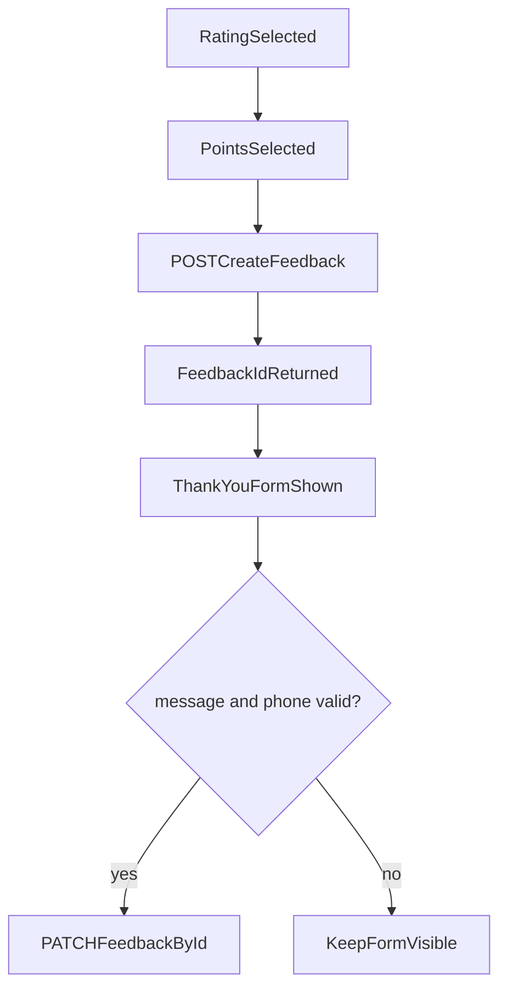

# Future-Proof Feedback + Dashboard Plan

## Why IDs are needed (simple explanation)
- Label बदल सकता है (`"Food quality"` -> `"Food & Taste"`), लेकिन ID stable रहती है.
- Dashboard analytics label पर नहीं, stable ID पर बने तो historical data नहीं टूटता.
- Owner को quick insights देने के लिए grouping reliable होनी चाहिए; यह IDs से आसान होता है.

## Core design principle
- `store both` approach:
  - `selectedPointIds`: machine-stable analytics key
  - `selectedPoints`: human-readable snapshot at submission time
- इससे speed + flexibility + rename safety तीनों मिलते हैं.

## Recommended data model (Postgres + Prisma)
- `Feedback`
  - `id`
  - `restaurantId`
  - `rating`
  - `selectedPointIds String[]`
  - `selectedPoints String[]`
  - `message String?`
  - `contactNumber String?`
  - timestamps
- `FeedbackNode` (for future custom tree per restaurant)
  - `id` (UUID/CUID)
  - `restaurantId`
  - `parentId` (nullable)
  - `label`
  - `slug` (optional)
  - `sortOrder`
  - `isActive`

## Submission flow (already close to your current code)
- Step A: user path complete -> `POST /feedback/:restaurantId`
  - save `rating`, `selectedPointIds`, `selectedPoints`
  - return `feedbackId`
- Step B: thank-you form submit (only when valid fields filled) -> `PATCH /feedback/:feedbackId`
  - save `message`, `contactNumber`

## Dashboard UX for busy owners (quick and easy)
- Default view should be 3 blocks only:
  - Today score (avg rating + response count)
  - Top 5 issue buckets (from `selectedPointIds`)
  - Requires action (low ratings + phone provided)
- One-click filters: `Today`, `Last 7 days`, `Last 30 days`.
- Drill-down optional: owner can tap only if needed; default surface should already answer “what to fix first”.

## API shape for dashboard (fast reads)
- `GET /dashboard/summary?restaurantId=...`
  - avg rating, total feedback count, trend
- `GET /dashboard/issues?restaurantId=...&range=7d`
  - grouped by `selectedPointIds` with display label fallback
- `GET /dashboard/actionable?restaurantId=...`
  - low-rating feedback with contact number

## Migration-safe rollout plan
1. Keep current frontend flow as-is, ensure POST always saves both IDs+labels.
2. Add backend mapping table (`FeedbackNode`) in parallel.
3. Start reading dashboard analytics from IDs.
4. Later enable restaurant custom node editor.
5. On label rename, no feedback history migration needed (IDs unchanged).

## Current code alignment notes
- [`components/FeedbackPages/FeedbackFlow.tsx`](components/FeedbackPages/FeedbackFlow.tsx) already follows two-step create-then-patch pattern.
- [`constants/index.ts`](constants/index.ts) already has stable tree node IDs for shared flow.
- [`interface/index.ts`](interface/index.ts) already carries `selectedPointIds` + `selectedPoints` payload shape.